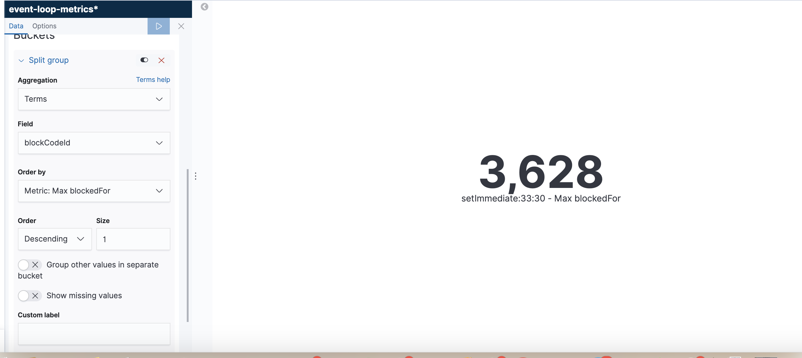
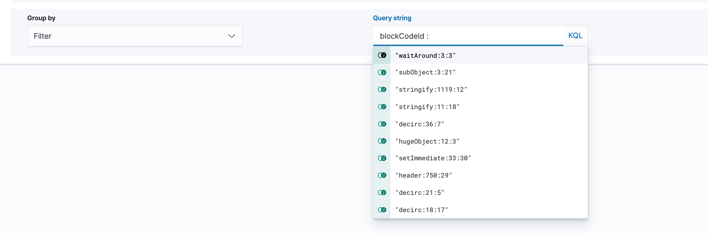
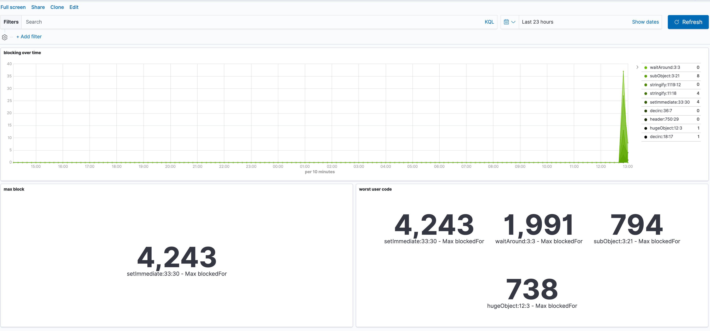

### Install / Run 
-----

Set NSolid webhook endpoint to: `/eventloop`, and specify the port which the metric server is running on (default to `3001`)

```bash
docker-composes build && docker-compoes up
```

This will spin up 3 containers:

1. Elatsicsearch "cluster" (single node and no configuration)

2. Kibana container that comunicate with the above ES "cluster"

3. Very(!) simple node.js server to handle all webhooks from NSolid

The next thing would be to use `bin/blast` (add the link here) inside snyk project to generate some data we can observe. and go over to the next part.

##### Environment Variables Configuration
 
* `PORT` - metric-service server listen port, this should be set on NSolid. default: `3001`
* `ELASTIC_ENDPOINT` - the endpoint for elasticsearch node. Default to `http://elasticsearch:9200`
* `ELASTIC_METRIC_INDEX` - ES index to send eventss to. Default to `event-loop-metric`


### Solution considerations
-----

Choosing elasticsearch due to it's over-time abilities, my prior knowledge with it and a really easy way to visualize data through Kibana. 

The simple setup (sure, there is only one node and in the real-world production ready case there should be much more work done around it) and the prior knowledge that this should be suffice to answer the wanted questions, and in over all this could make observability really nice and easy for any software eng to reason about.

Document example:

```json
{
  "_index": "event-loop-metrics",
  "_type": "_doc",
  "_id": "BGU9zWwBux_JJ2JxW57j",
  "_version": 1,
  "_score": null,
  "_source": {
    "time": "2019-08-26T09:24:06.217Z",
    "event": "nsolid-process-blocked",
    "app": "sample-app",
    "appVersion": "1.0.0",
    "hostname": "AviadS-MBP.local",
    "column": 30,
    "lineNumber": 33,
    "functionName": "setImmediate",
    "userCode": true,
    "file": "/Users/aviad.shikloshi/projects/snyk/sre-exercise-sample-app/index.js",
    "blockCodeId": "setImmediate:33:30",
    "blockedFor": 832,
    "stack": "    at setImmediate (/Users/aviad.shikloshi/projects/snyk/sre-exercise-sample-app/index.js:33:30)\n    at runCallback (timers.js:818:20)\n    at tryOnImmediate (timers.js:776:5)\n    at processImmediate (timers.js:753:5)"
  },
  "fields": {
    "time": [
      "2019-08-26T09:24:06.217Z"
    ]
  },
  "sort": [
    1566811446217
  ]
}
```

### Visualization

Go to: (http://localhost:5601/app/kibana#/visualize?_g=())

1. Identify the wost blocking code: "max block" visuaslization will tell  you which is the most current worse code in terms of blocking nodejs event loop.



2. Here I had some problems to identify both who is the calling blocked function (I guess with more time I could figure this out), and how to determine in sain way if function is owned by user or JS native / libs etc (identiry `node_modules` was much easier).

3. Watch blocking events over time: "blocking over time" visualization will answer this.

This is for all blocking events, you can easily filter this using "Group by: Filter" with the KQL query string being, for example:  `blockCodeId : "waitAround:3:3" `

Example:


You can use the dashboard I made, under the "Dashboards" Kibana section. With some improvment this can be a nice way to observe event-loop issues...




#### Fixes / Improvments:

- [ ] Send to ES bulk of events (using count of events + deadline for send).

- [ ] Add the ability to identify JS library code (to answer 2). Currently we are only identifying that this is not a `node_modules`.  

- [ ] Metric for our service, maybe run it with Nsolid :)
- [ ] Adding raw ES query DSL
